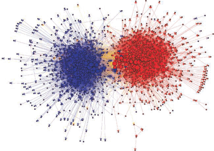
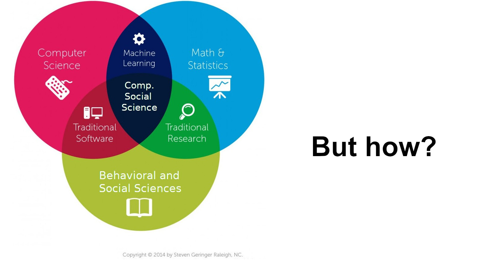
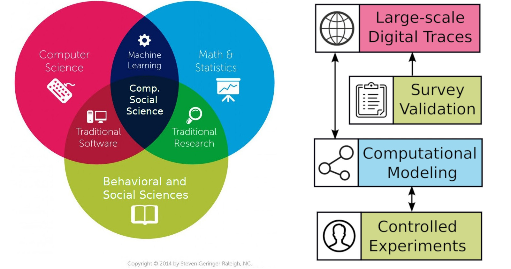
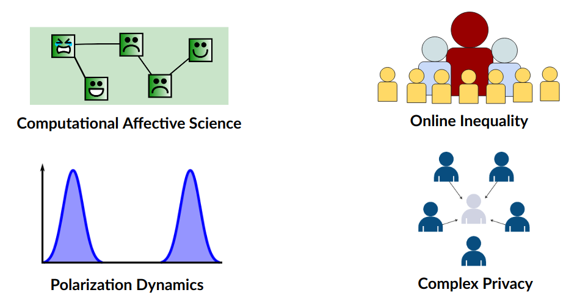
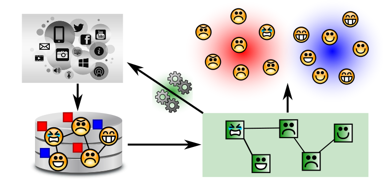
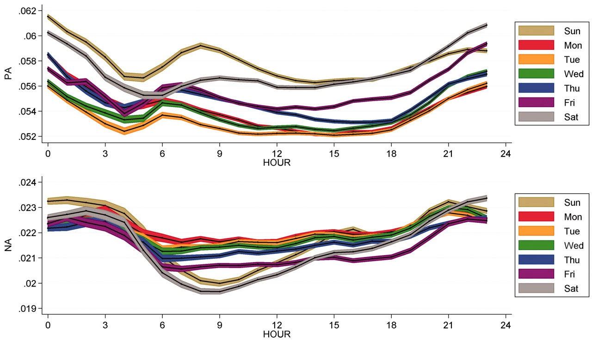
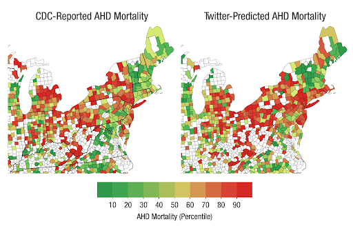
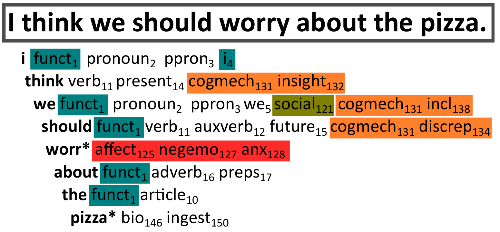
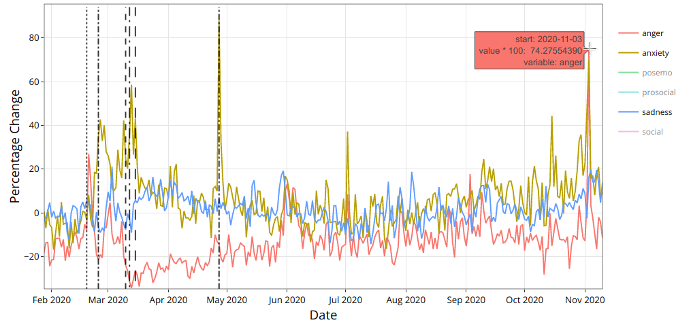
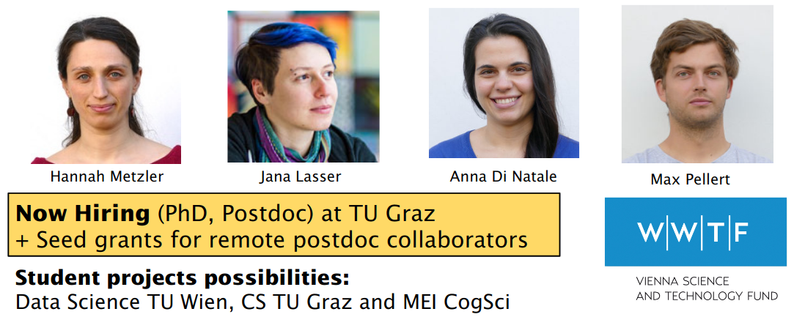

```{r xaringan-themer, include=FALSE, warning=FALSE}
#This block contains the theme configuration for the CSS lab slides style
library(xaringanthemer)
library(showtext)
style_mono_accent(
  base_color = "#5c5c5c",
  text_font_size = "1.5rem",
  header_font_google = google_font("Arial"),
  text_font_google   = google_font("Arial", "300", "300i"),
  code_font_google   = google_font("Fira Mono")
)
```

```{r setup, include=FALSE}
options(htmltools.dir.version = FALSE)
```


layout: true
<div class="my-footer"><span>David Garcia - Computational Social Science Lab - TU Graz + CSH Vienna</span></div> 

---
class:center
# About me

.pull-left[
```{r, echo=FALSE, out.width=270}
knitr::include_graphics("figures/Profile.jpg")
```
]

.pull-right[
<br>
Website: [dgarcia.eu](https://dgarcia.eu)

Twitter: [@dgarcia_eu](https://twitter.com/dgarcia_eu)

Github: [dgarcia-eu](https://github.com/dgarcia-eu)

Email: garcia@csh.ac.at
]

Professor for Computational Behavioral and Social Sciences at TU Graz
<br>Faculty member of the Complexity Science Hub Vienna
<br>Group leader at the Medical University of Vienna
<br>Privatdozent at ETH Zurich, teaching Social Data Science

---


# Computational Social Science

> Quantitative testing theories from the social sciences at unprecedented 
breadth and depth and scale.                      (Lazer et. al. Science, 2009)

.pull-left[
- Quantitative and empirical, <br>
not just theoretical

- Not data-driven studies: interdisciplinary research

- *Related but not the same as Big Data, Data Science, Web Science, Digital Sociology, Human-Computer Interaction...*
]

.pull-right[
```{r, echo=FALSE, out.width=500}

```
]

---


## *Computational* in Computational Social Science
It can have three meanings:

- **Digital**<br> 
Based on large datasets of human behavior, for example produced by the Web and social media

- **Computerized**<br>
The quantitative analysis of data in an automated, tractable, repeatable, and extensible fashion

- **Generative**<br>
Application of data and results to design of agent-based models that explain complex social phenomena and motivate interventions

---

## New Data for the Social and Behavioral Sciences
<br>
- **Big Data:** Observing large and diverse sets of humans

- **Fast Data:** Quantifying human behavior in real time

- **Long Data:** Retrieving longitudinal data and at various timescales

- **Deep Data:** Gathering persistent information on individuals

- **Mixed Data:** Combining heterogeneous and unstructured data

- **Weird Data:** Analyzing behavior unobservable in experiments or surveys

---


## Strengths and weaknesses of digital trace data

**Strengths:**
- Complementary approach to traditional survey and experimental methods
- Unprecedented scales and granularities
- Ease of data access, replicability of results
- Potentially high external validity, behavior in vivo

**Weaknesses:**
- Limits to internal validity: Lack of counterfactuals hinders causal analysis
- Self-selection bias: Who talks? Normalization issues: Who is silent?
- Data gatekeepers, Twitter as a model organism
- Intractability of black-box predictions and data piñatas

<div style="font-size:15pt">
[Sen et al. (2019). A Total Error Framework for Digital Traces of Humans.](https://arxiv.org/abs/1907.08228)<br>
[Olteanu et al. (2019). Social Data: Biases, Methodological Pitfalls, and Ethical Boundaries.](https://www.frontiersin.org/articles/10.3389/fdata.2019.00013/full)

---

# Avoid making a data piñata

```{r, echo=FALSE, out.width=1050}
knitr::include_graphics("figures/pinata.png")
```

---

# "Interdisciplinarity" in CSS

<center>
```{r, echo=FALSE, out.width=950}

```

---

# *Interdisciplinarity* in CSS

<center>
```{r, echo=FALSE, out.width=950}

```

---

# Research lines at CSS Lab

<center>
```{r, echo=FALSE, out.width=950}

```

---

# Computational Affective Science

**Computational Affective Science:** Combining big social data and computational modeling to understand affective life and emotional well-being

<center>
Topic of WWTF Complexity Science Vienna Research Group (1.6M Euro)  
<br>
```{r, echo=FALSE, out.width=700}

```

---


## Examples of Computational Affective Science

.pull-left[
```{r, echo=FALSE, out.width=600}

```
Mood expression oscillates in Twitter
]

.pull-right[
```{r, echo=FALSE, out.width=500}

```
Affect in Twitter and heart diseaes
]

<div style="font-size:14pt">
[Diurnal and Seasonal Mood Vary with Work, Sleep, and Daylength Across Diverse Cultures. S. Golder, M. Macy. Science, 2011](https://science.sciencemag.org/content/333/6051/1878)<br>
[Psychological language on Twitter predicts county-level heart disease mortality. J. Eichstaedt et. al. Psychological Science, 2015](https://journals.sagepub.com/doi/10.1177/0956797614557867)
---

## The Social Function of Collective Emotions

<center>
```{r, echo=FALSE, out.width=900}
knitr::include_graphics("figures/ColectiveEmotions.png")
```
</center>

- **Theory of collective effervescence (Durkheim, 1912):**
Shared emotions generate social identity, reinforce shared beliefs, and lead to higher solidarity

- **Collective emotions (von Scheve and Salmela, 2014):**   
Emotional states shared by a large amount of people at the same time


---

background-size: 40%
background-image: url(figures/Trauma.png)
background-position: 90% 60%


## Emotional Responses to Collective Traumas

**How do societies respond to traumatic events?**  
**Is there a social function of collective emotions?**
.pull-left[
- Emotional synchronization: Experience of simultaneous negative emotions

- Collective emotion lasts longer than individual emotional reactions

- Individuals that participate in the collective emotions show higher levels of long-term solidarity ]

---

## Twitter Digital Traces after a Terrorist Attack

Focus on Paris Attacks of of Nov 13, 2015  
Removed bots, news media, and organizations. Final sample of 62,114 users  
Retrieved historical timeline of users. Total of more than 27 Million tweets (no RT)
<center>
```{r, echo=FALSE, out.width=900}
knitr::include_graphics("figures/ParisCase.png")
```

---

## Linguistic Signals

**Linguistic Inquiry and Word Count, LIWC (pronounced “Luke”)**  
- Simple word matching method  
- Validated by psychologists, years of implementation (2001-2015)  
- Multiple classes, calibrated for netspeak and neologisms


.pull-left[
```{r, echo=FALSE, out.width=1000}

```
]
.pull-right[
**LIWC classes in this study:**  
Positive Affect, Negative Affect  
Anxiety, Sadness, Anger  
Social processes  
Prosocial terms (Frimer, et. al, 2014)  
French values (libert*, egalit*, fraternit*)
]

---

## Agent-Based Modelling of Collective Emotions

.pull-left[
```{r, echo=FALSE, out.width=1000}
knitr::include_graphics("figures/Framework.png")
```

ABM calibrated with experiment data
- φ: post-shock AR(1) term
- φ~0: subcritical response
- φ>0: critical, collective behavior
]

.pull-right[
```{r, echo=FALSE, out.width=450}
knitr::include_graphics("figures/Simulation.png")
```
<center>
Mean valence in simulations
</center>
]

<div style="font-size:14pt">
[The Dynamics of Emotions in Online Interaction. Garcia et al. Royal Society Open Science 3 (2016)](https://royalsocietypublishing.org/doi/full/10.1098/rsos.160059)

---

## Evidence of Collective Emotions
<center>
```{r, echo=FALSE, out.width=750}
knitr::include_graphics("figures/TS.png")
```
</center>

---

### Collective Dynamics of Social Resilience Indicators
<center>
```{r, echo=FALSE, out.width=720}
knitr::include_graphics("figures/TS2.png")
```
</center>


---

# Emotional Synchronization Effect

.pull-left[
<center>
```{r, echo=FALSE, out.width=470}
knitr::include_graphics("figures/TS3.png")
```
</center>
]

.pull-right[
Division of users into two groups based on their emotional expression two weeks after the attacks

Frequency of social process terms:
- Very similar before the attacks
- Strong difference after the attacks
- Difference lasts for months

Similar effect for prosocial terms and shared values terms
]

---

# Conclusions

- Terrorist attacks trigger collective emotions that we can observe online

- Terms related to social resilience increase after collective emotions

- Individuals expressing stronger emotions used on average more terms related to social processes, prosocial behavior, and shared values

- Collective emotions are not just venting, they can keep us together

- Negative effects: inter-group conflict, intolerance, short-term orientation...

- Online interactive visualization at: http://dgarcia.eu/ParisAttacks.html

[**Collective Emotions and Social Resilience in the Digital Traces After a Terrorist Attack. David Garcia Bernard Rimé. Psychological Science (2019)**](https://journals.sagepub.com/doi/full/10.1177/0956797619831964)

---

class:center

## Appendix: The Vienna terrorist attack of Nov 2nd


---

class:center

## Austrian Emotions on Twitter

```{r, echo=FALSE, out.width=900}

```

<div style="font-size:15pt"> 
Paper: [Dashboard of Sentiment in Austrian Social Media During COVID-19. Frontiers in Big Data. Pellert et al. (2020)](https://www.frontiersin.org/articles/10.3389/fdata.2020.00032/full)  
Dashboard: https://mpellert.at/covid19_monitor_austria
---

class:center

## Austrian Emotions in Der Standard Tickers

```{r, echo=FALSE, out.width=900}
knitr::include_graphics("figures/Dashboard2.png")
```
<div style="font-size:15pt"> 
Paper: [Dashboard of Sentiment in Austrian Social Media During COVID-19. Frontiers in Big Data. Pellert et al. (2020)](https://www.frontiersin.org/articles/10.3389/fdata.2020.00032/full)  
Dashboard: https://mpellert.at/covid19_monitor_austria
---

background-size: 50%
background-image: url(figures/OpenDoor.gif)
background-position: 90% 60%


## Shelter offerings on Twitter

.pull-left[

- Number of tweets with hashtags similar to [#Schwedenplatztür](https://twitter.com/hashtag/schwedenplatzt%C3%BCr)
- More in Twitte thread:
https://twitter.com/dgarcia_eu/status/1324097342551842817
]

---


class:center

# By the Computational Social Science Lab

```{r, echo=FALSE, out.width=1200}

```
**Thanks for listening! More at www.dgarcia.eu and [@dgarcia_eu](https://twitter.com/dgarcia_eu)**
